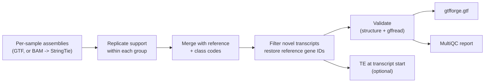

# GTFforge


**Build a replicate-supported, reference-anchored custom transcriptome from
RNA-seq assemblies** -- a GTF you can hand straight to nf-core/rnaseq, STAR or
Salmon.

Reference annotations miss much of what some cells transcribe: oocytes and
early embryos start many transcripts inside LTR retrotransposons, knockouts of
TE repressors switch on new TE-driven isoforms, tumours splice in new ways.
The usual remedy -- assemble with StringTie, `stringtie --merge`, use the
result -- adds every one-replicate artefact as a "transcript", and its gene
IDs (`MSTRG.*`) silently fuse neighbouring reference genes. GTFforge keeps
only what replicates agree on and leaves the reference's gene IDs intact.



Full rule-level diagram: [docs/pipeline-flowchart.md](docs/pipeline-flowchart.md).

## What it does

1. **Replicate support, per group.** Within each group of the sample sheet
   (e.g. `GV_WT`, `GV_KO`), one gffcompare over the replicates' assemblies
   lists which samples assembled each unique intron chain. A chain is kept if
   it was assembled in at least
   `max(support.min_samples, ceil(n_group * support.min_fraction))` samples
   -- with the defaults, 2 of 6, 3 of 8, 4 of 12. Counting within groups means
   a transcript specific to one condition (a knockout-only TE-driven isoform)
   is kept, while one-replicate noise is not.
2. **Single-exon transfrags** are dropped for unstranded libraries (no strand
   can be assigned, and they are mostly intronic/pre-mRNA noise); for stranded
   groups the stranded ones are kept (`support.single_exon`).
3. **Clean the reference** once, before anything is compared to it: transcript
   IDs reused at several loci (UCSC refGene does this) are dropped -- left in,
   one such ID spans every copy and makes intergenic transcripts look intronic
   -- and so are transcripts on contigs outside `filter.keep_contigs_regex`.
4. **Merge** the supported transcripts of every group with the reference
   (`stringtie --merge -G`), and classify each against the reference with
   gffcompare.
5. **Finalize.**
   - Reference features are kept verbatim; genes spread over several
     chromosomes/strands are split.
   - Novel transcripts are kept if their class code is in
     `filter.keep_classes` (default `jkxuioy`), they have a strand, sit on a
     kept contig, and match a group-supported intron chain exactly.
   - **Gene IDs:** new isoforms of a reference gene (classes `j`, `k`) keep
     that gene's ID, so gene-level counts of known genes stay comparable with
     a reference-only run. Everything else becomes a novel gene named after
     its StringTie locus (`MSTRG.123`), with `gene_type "novel"`.
   - Gene lines are regenerated to span all their transcripts.
6. **Validate.** The GTF is checked for everything that breaks downstream
   tools (unique transcript IDs, one locus per gene, exons, strands, spans) and,
   with `ref.fasta`, gffread must extract every transcript -- the same step
   nf-core/rnaseq runs before indexing. Only a GTF that passes is published.
7. **TE annotation** (optional, `ref.te_gtf`): the TE insertion at each novel
   transcript's start site and first exon, with orientation.

Attribute conventions (GENCODE `gene_type`, Ensembl `gene_biotype`) are
detected from the reference and reused for novel features.

## Quick start

```bash
git clone https://github.com/altintasali/GTFforge.git
cd GTFforge
conda env create -f workflow/environment.yaml
conda activate gtfforge

# config + sample sheet
python workflow/scripts/gtfforge init
python workflow/scripts/gtfforge samples --gtf-dir /path/to/stringtie --force   # or --bam-dir
$EDITOR input/config.yaml        # set ref.gtf (and optionally fasta, te_gtf)

python workflow/scripts/gtfforge run --cores 8 --dry-run
python workflow/scripts/gtfforge run --cores 8
# on SLURM:
python workflow/scripts/gtfforge run --profile slurm
```

`gtfforge samples` infers each sample's group by stripping a trailing
replicate number from its name (`GV_WT_01` -> `GV_WT`); pass `--group-regex`
for other naming schemes, and check the group summary it prints.

An analysis directory does not have to be a checkout: `gtfforge run
--directory /my/analysis` links `workflow/` into it.

### Inputs

**Sample sheet** (`input/samples.csv`):

| column | |
|---|---|
| `sample` | unique name |
| `group` | replicate group; support is counted within it. At least 2 samples per group |
| `gtf` | per-sample assembly (StringTie output, `.gtf` or `.gtf.gz`), **or** |
| `bam` | coordinate-sorted BAM; GTFforge runs StringTie (`assembly:` settings) |
| `strandedness` | `unstranded` (default) / `forward` / `reverse` |

GTF and BAM rows can be mixed. The per-sample `*.transcripts.gtf` files of
nf-core/rnaseq are only usable if StringTie ran **without** `-e`
(`--stringtie_ignore_gtf`); with `-e` they hold no novel transcripts.

**Config** (`input/config.yaml`): see [config/config.example.yaml](config/config.example.yaml).
Only `samples` and `ref.gtf` are required.

### Outputs

| file | |
|---|---|
| `results/gtfforge.gtf` | the custom annotation (validated) |
| `results/novel_transcripts.tsv` | every novel transcript: gene, class code, supporting groups, coordinates, TEs at its start |
| `results/README_nfcore.txt` | the nf-core/rnaseq flags this GTF needs |
| `results/qc/multiqc_report.html` | support histograms, filters, class codes, TE families, config, versions |
| `results/validation/validation.json` | validation report |

## Using the GTF with nf-core/rnaseq

```bash
nextflow run nf-core/rnaseq --gtf results/gtfforge.gtf --fasta genome.fa \
    --featurecounts_group_type gene_type   # GENCODE-style references only
```

- **Do not pass `--gencode`** -- novel transcripts do not follow GENCODE's ID
  scheme.
- **Do not reuse STAR/Salmon indices** built from the original annotation.
  STAR projects reads onto the transcripts stored in its index, so novel
  transcripts would get no reads. Let nf-core rebuild them (`--save_reference`
  keeps them for reruns).
- `results/README_nfcore.txt` lists exactly what applies to your reference.

## HPC / SLURM

`workflow/profiles/slurm` submits each rule as a SLURM job (account/qos set
for the ICMM_DM group -- edit for your cluster). Per-rule threads, memory and
runtime are in `workflow/default-config/resources.yaml`; override any of them
in `input/resources.yaml`. Tools run from the shared `gtfforge` environment;
make sure it is visible from the compute nodes.

## Tool versions

Pinned in `workflow/default-config/versions.yaml` and
`workflow/environment.yaml` (CI checks the two agree): StringTie 2.2.1,
gffcompare 0.12.6, gffread 0.12.7, MultiQC 1.33. Override in
`input/versions.yaml`.

## Pre-built environment

Tagged releases attach a packed Linux x86_64 conda environment:

```bash
mkdir -p env && tar -xzf gtfforge-<version>-env.tar.gz -C env && env/bin/conda-unpack
source env/bin/activate
```

## Development

```bash
python -m pytest .tests/unit                    # unit tests
.tests/guards/run.sh                            # behaviour guards (or: run.sh 7)
snakemake --configfile config/test.yaml --cores 2   # end-to-end on synthetic data
python .tests/generate_test_data.py             # regenerate the synthetic data
```

The synthetic dataset gives every filter one novel structure with a known
fate (kept as a `j` isoform, kept as antisense, dropped for low support, ...);
guard 01 fails if any of them changes.

## Background

The approach generalises the oocyte transcriptome construction of
Stäubli et al. (*The Trim28 Transcriptome*; after Franke et al. 2017, *Genome
Research*), adding per-group replicate support, reference gene-ID
restoration and validation. It relies on
[StringTie](https://ccb.jhu.edu/software/stringtie/) (Pertea et al. 2015) and
[gffcompare / gffread](https://ccb.jhu.edu/software/stringtie/gff.shtml)
(Pertea & Pertea 2020) -- please cite them.

## License

MIT -- see [LICENSE](LICENSE).
